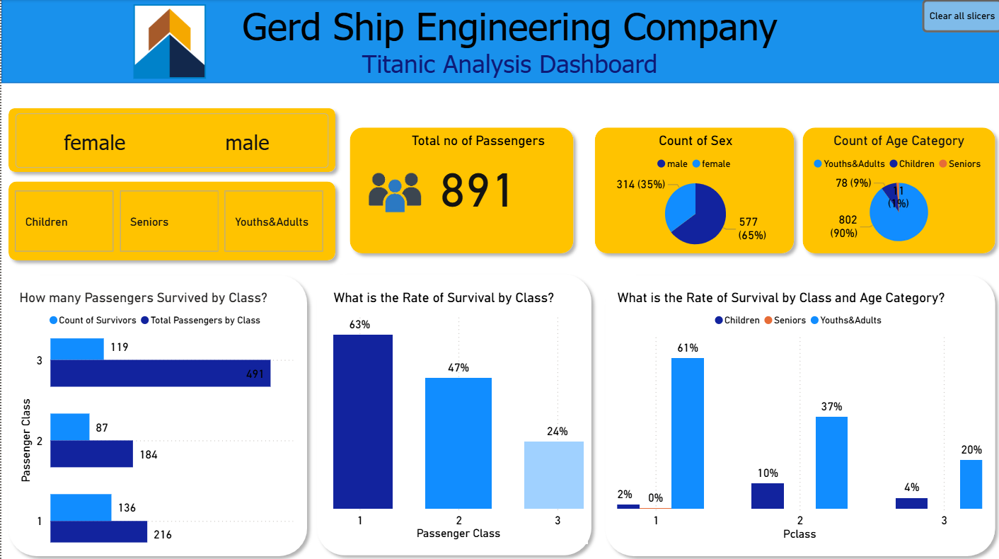

# 🚢 Titanic Survival Analysis Dashboard

**A Data-Driven, End-to-End Project for Equitable and Safer Ship Design**
*By Gerd Ship Engineering Company*

## 📌 Goal

The objective of this project is to investigate survival disparities among Titanic passengers by:
* **Passenger Class**
* **Age Category**
* **Sex**

The insights will inform safer, more equitable ship designs by identifying the most vulnerable passenger categories.

---

## 🛠️ Tools & Technologies

This project was developed as a complete **end-to-end data analytics pipeline** using:

| Tool         | Purpose                                                      |
| ------------ | ------------------------------------------------------------ |
| **Python**   | Data extraction, transformation, and export                  |
| **SQL**      | Querying and aggregating cleaned data                        |
| **Power BI** | Interactive dashboard development and insights visualization |

---

## ⚙️ Python Workflow (ETL Process)

```python
import pandas as pd
import gdown
from sqlalchemy import create_engine

# Step 1: Download Titanic CSV from Google Drive
file_id = '15cFsnPnHc7KlzV0C9QQ5wG5v8PWqJ65C'
download_url = f'https://drive.google.com/uc?id={file_id}'
gdown.download(download_url, 'titanic_data.csv', quiet=False)

# Step 2: Load into DataFrame
df = pd.read_csv('titanic_data.csv')

# Step 3: Upload to PostgreSQL
df.to_sql('titanic_table', engine, if_exists='replace', index=False)

# Step 4: Query relevant fields
query = 'SELECT "PassengerId", "Survived", "Pclass", "Age", "Sex" FROM titanic_table'
project_data_df = pd.read_sql(query, connection)

# Step 5: Clean and transform
project_data_df['Age'].fillna(project_data_df['Age'].mean(), inplace=True)
project_data_df['Age'] = project_data_df['Age'].round()

# Step 6: Categorize ages
def categorize_age(age):
    if age <= 14:
        return 'Children'
    elif 15 <= age <= 64:
        return 'Youths&Adults'
    else:
        return 'Seniors'

project_data_df['age_category'] = project_data_df['Age'].apply(categorize_age)

# Step 7: Export to Excel for Power BI import
project_data_df.to_excel('final.xlsx', index=False)
```

✅ *Data was successfully loaded, cleaned, categorized, and exported for visualization in Power BI.*

---

## 📊 Dashboard Overview

**File:** [`Titanic Analysis Dashboard.pbix`](Titanic%20Analysis%20Dashboard.pbix)
**Tool:** Power BI
**Key Visuals**:

* Survival rate by **Class**, **Sex**, and **Age**
* Total passengers by demographic
* Interactive slicers for targeted filtering

> 

---

## 🔍 Key Insights

* **First-Class passengers** had the **highest survival rate (63%)**, while **Third-Class** had the **lowest (24%)**.
* **Youths & Adults** in First Class had a **61% survival rate**, the highest among all demographics.
* **Children** had the highest rate in Second Class (10%), but **Seniors had 0% survival** across all classes.
* **Female passengers**, especially in First and Second Class, had consistently better outcomes — likely due to prioritized evacuation protocols.

---

## 🔧 Implications for Ship Design

Based on these findings, we recommend the following for future ship engineering:

* Minimize **class-based disparities** in emergency evacuation
* Prioritize safety for **seniors and children**
* Apply **inclusive safety systems** for all demographics
* Use insights to guide **further statistical modeling** and safety design

---

## 📁 Project Structure

```
Titanic-Survival-Analysis/
│
├── Titanic Analysis Dashboard.pbix   # Power BI report
├── final.xlsx                        # Cleaned dataset for BI import
├── titanic_data.csv                 # Original Titanic dataset
├── images/
│   └── image.png                     # Dashboard screenshot
└── README.md                         # Project documentation
```

---

## 🚀 Getting Started

1. Clone the repository.
2. Open `Titanic Analysis Dashboard.pbix` in Power BI Desktop.
3. Use filters to interact with the data by sex and age category.
4. Analyze insights for ship safety planning.

---

